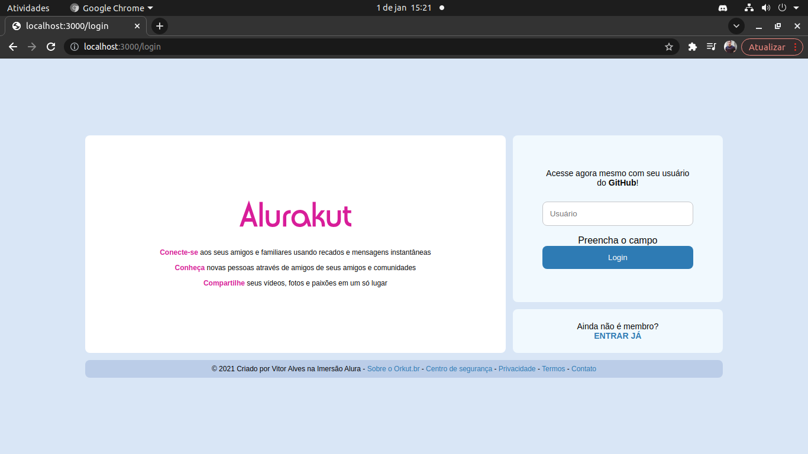
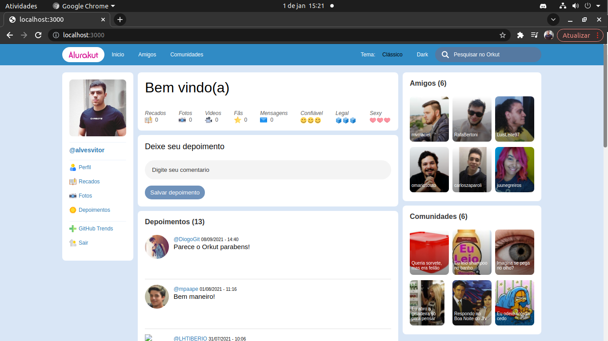
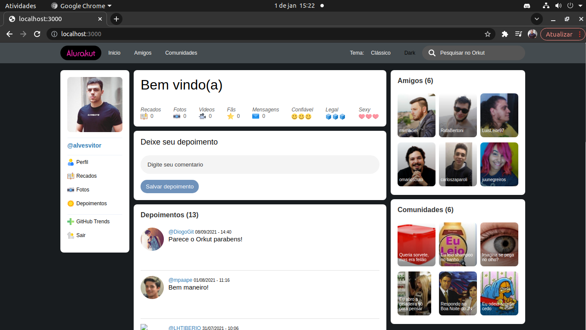

<h1 align = "center" fontSize="60px">
 Projeto desenvolvido durante a Imersão React da Alura 
</h1>

  

  

  

### Link

[Link do projeto na vercel](https://alurakut-one-wheat-34.vercel.app/login)

## :rocket: Tecnologias usadas

 
   
  
 
 

